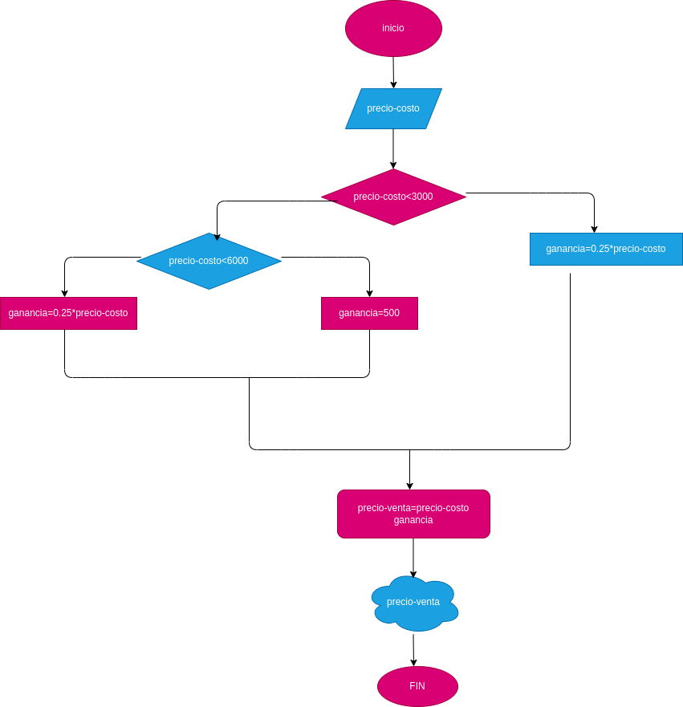

# ANALISIS

Variable de entrada (input)

precio-costo: precios al que se le compra el producto

ganancia: porsentaje de rentabilidad de cada producto

precio-costo: precios al que se le compra el producto
             precio-vena= precio-costo+ganancia

ganancia=15% del precio-costo si es <3000                                                          $500 si precio-costo es [3000,6000]                                                                                               20% del precio-costo si es >600                                                                         

 # DISEÑO 

 # construccion 